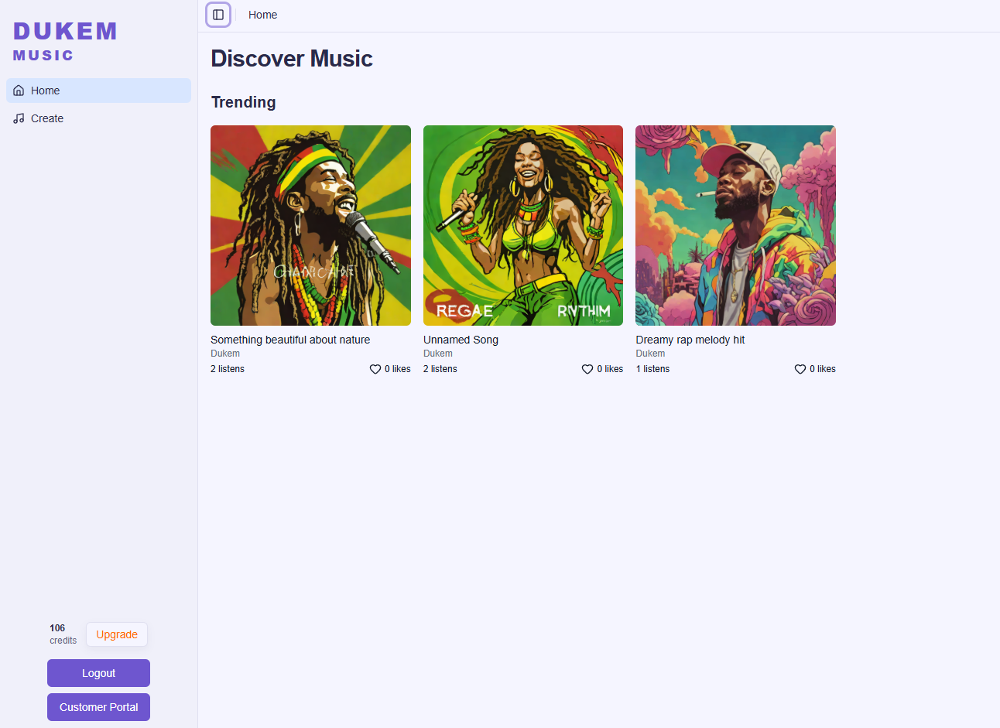
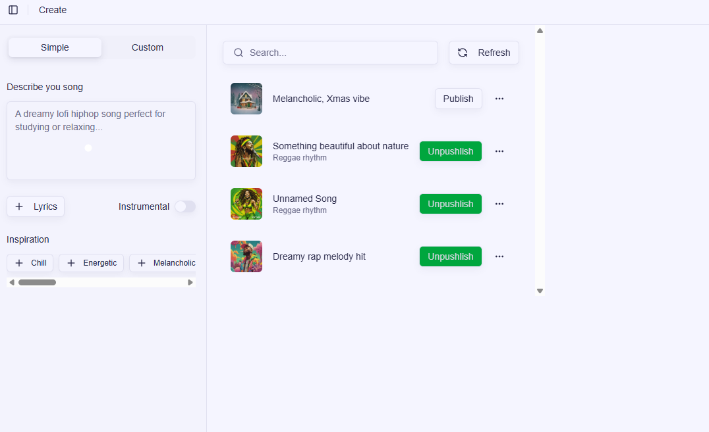

# Dukem Music

Dukem Music is an AI-powered music generation platform. It allows users to generate songs using advanced AI models, managed through a modern web interface.
## Live Demo
Check out the live demo at: [https://dukem-music.vercel.app/](https://dukem-music.vercel.app/)

## Features
- **AI Music Generation**: Generate unique songs using state-of-the-art AI models.
  
  





## 🏗 Architecture

The project is a monorepo consisting of:

- **Frontend**: A [Next.js 15](https://nextjs.org/) application using the App Router, Tailwind CSS v4, and Shadcn UI. It handles user interaction, authentication, and payments.
- **Backend**: A Python-based AI inference engine running on [Modal](https://modal.com/). It handles the heavy lifting of audio generation.
- **Orchestration**: [Inngest](https://www.inngest.com/) is used for background job processing and orchestrating the communication between the frontend and the AI backend.
- **Database**: PostgreSQL with [Prisma](https://www.prisma.io/) ORM.
- **Storage**: AWS S3 for storing generated audio files and cover art.

## 🚀 Tech Stack

### Frontend
- **Framework**: Next.js 15 (App Router)
- **Language**: TypeScript
- **Styling**: Tailwind CSS v4, Shadcn UI
- **Auth**: Better Auth
- **Payments**: Polar.sh
- **State/Data**: Prisma, Inngest

### Backend
- **Platform**: Modal (Serverless GPU)
- **Language**: Python
- **Libraries**: Pydantic, Boto3

## 🛠 Getting Started

### Prerequisites

- Node.js (v18+)
- Python (v3.10+)
- PostgreSQL database
- Modal account and CLI installed
- AWS S3 Bucket credentials

### 1. Environment Setup

Create a `.env` file in the `frontend` directory based on your environment configuration. You will need keys for:
- Database URL (`DATABASE_URL`)
- Better Auth Secret (`BETTER_AUTH_SECRET`)
- Polar.sh (`POLAR_ACCESS_TOKEN`, `POLAR_WEBHOOK_SECRET`)
- AWS S3 (`AWS_ACCESS_KEY_ID`, `AWS_SECRET_ACCESS_KEY`, `AWS_REGION`, `AWS_BUCKET_NAME`)
- Modal Environment details

### 2. Frontend Setup

Navigate to the frontend directory:

```bash
cd frontend
```

Install dependencies:

```bash
npm install
```

Set up the database:

```bash
npm run db:generate  # Generate Prisma Client
npm run db:migrate   # Run migrations
```

Start the development server:

```bash
npm run dev
```

Start the Inngest dev server (in a separate terminal):

```bash
npm run inngest:dev
```

The frontend will be available at `http://localhost:3000` and Inngest dashboard at `http://localhost:8288`.

### 3. Backend Setup

Navigate to the backend directory:

```bash
cd backend
```

Install Python dependencies (optional, as Modal handles remote env):

```bash
pip install -r requirements.txt
```

Deploy or serve the Modal app:

```bash
# For local development/testing
modal serve main.py

# To deploy to production
modal deploy main.py
```

## 📂 Project Structure

```
.
├── backend/            # Python backend (Modal app)
│   ├── main.py        # Entry point and inference logic
│   └── requirements.txt
├── frontend/           # Next.js Frontend
│   ├── src/
│   │   ├── actions/   # Server Actions
│   │   ├── app/       # Next.js App Router pages
│   │   ├── components/# React components
│   │   ├── inngest/   # Inngest functions and client
│   │   ├── lib/       # Utilities and libraries
│   │   └── server/    # Database connection
│   └── prisma/        # Database schema
└── README.md
```

## 📝 License

[MIT](LICENSE)
